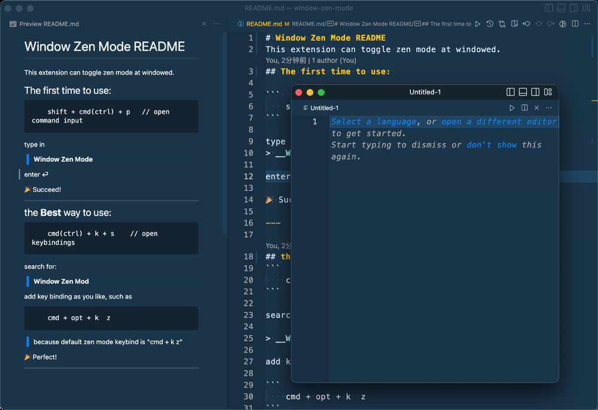

# Window Zen Mode README
This extension can toggle zen mode at windowed.
## The first time to use: 

``` 
    shift + cmd(ctrl) + p   // open command input
```

type in
> __Window Zen Mode__

enter ⏎

🎉 Succeed!

---

## the __Best__ way to use:
```
    cmd(ctrl) + k + s    // open keybindings
```

search for:

> __Window Zen Mod__

add key binding as you like, such as 

```
    cmd + opt + k  z
```
> because default zen mode keybind is "cmd + k  z"

🎉 Perfect!

---



# 🎉 <font color="#ffabd6">Cute!</font>  💻<br /> 


and some valuable key shot:
```
    cmd + b            // left side bar
    cmd + j            // bottom side bar
    cmd + shift + e    // file view
    ctrl + shift + g   // git source control
```    